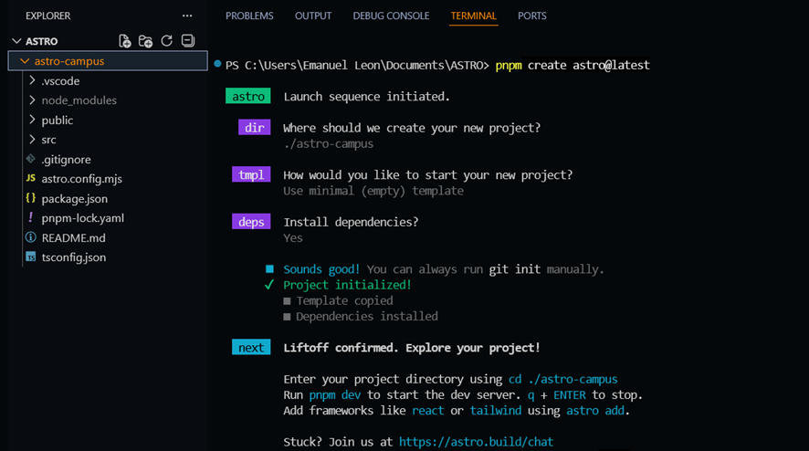
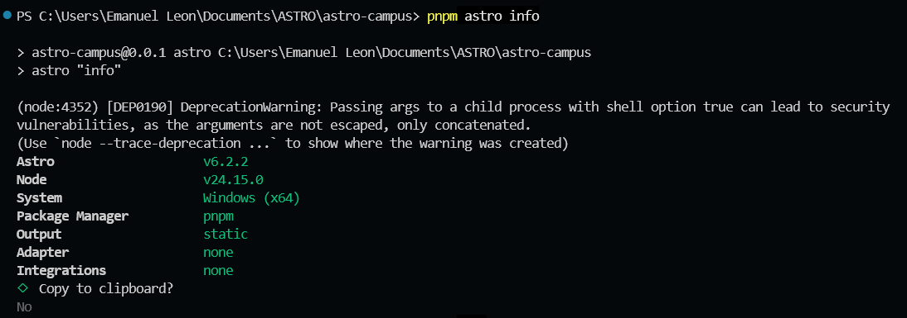
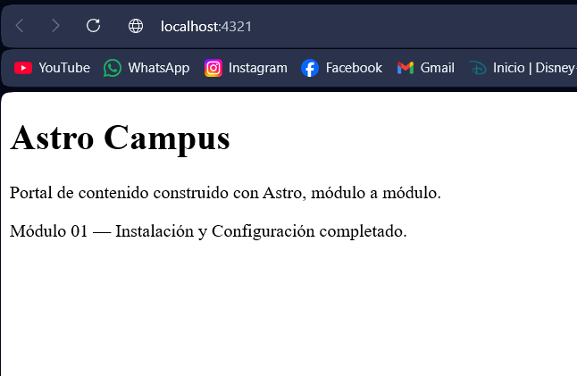
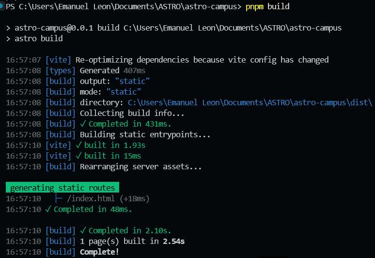
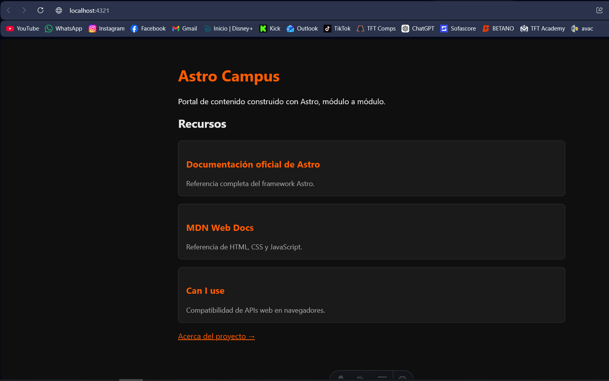
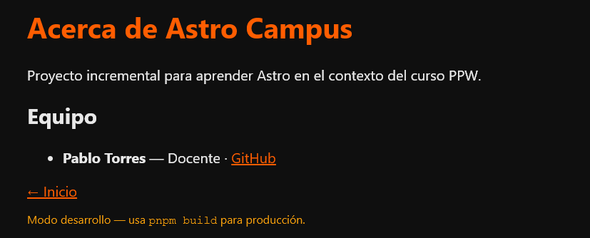
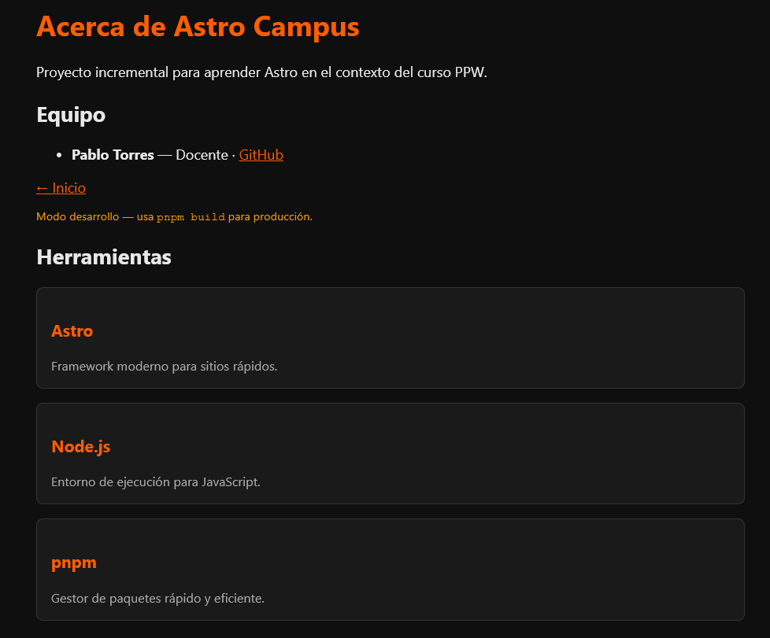

# 01. Instalación y Configuración de Astro

**Emanuel Leon**

---

## Descripción

En esta práctica se utilizó **Astro v6.2.2** para crear un proyecto web básico con generación de sitios estáticos.

Se verificó previamente el entorno de trabajo:

node --version  
pnpm --version  

---

## Actividades realizadas

- Creación de un proyecto Astro con plantilla mínima  
- Configuración básica del proyecto  
- Implementación de una página inicial  
- Verificación del entorno con comandos de Astro  

### Ejecutar servidor:  
pnpm dev  

---

## Evidencias

## Creación del proyecto  
  

## Información del entorno  
  

## Ejecución en localhost  
  

## Salida del build de producción
  
---

# 02. Fundamentos de Astro

---

## Descripción

En esta práctica se trabajó con conceptos fundamentales de Astro relacionados con componentes reutilizables, props y generación automática de rutas.

También se aplicó renderizado condicional y manejo de arreglos para mostrar información dinámica dentro de las páginas.

---

## Actividades realizadas

- Creación del componente `RecursoCard.astro`
- Uso de props para reutilizar componentes
- Implementación de tipado con TypeScript
- Creación de la página `about.astro`
- Uso de renderizado condicional
- Renderizado dinámico de listas con `.map()`

---

## Evidencias

### Home page con componentes Card

### Página About funcionando

### Sección de herramientas en about.astro

---

